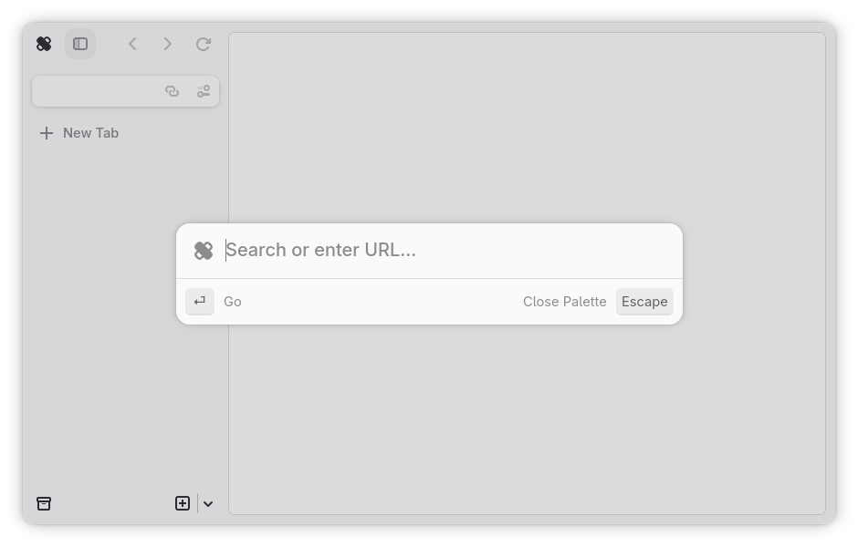
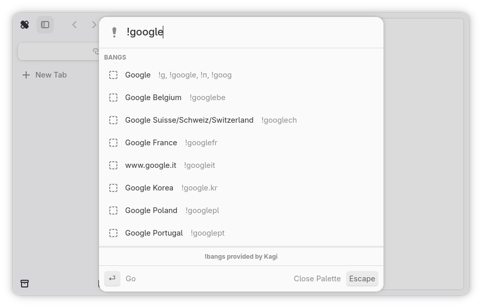

# Command Palette

The command palette is the main way of getting around Ouch Browser. Think of
it as the search bar of a conventional web browser, but contains more features.
Command palette includes support for !bangs and search autocompletion out of
box, which can both be disabled inside [preferences](preferences.md).

## !bangs

!bangs help you search websites that are not conventional search engines.
Autocompletion is possible via [preferences](preferences.md), but may use an
significant amount of resources due to the large amount of !bangs stored.

## Search

Search allows you to search the internet using the search engine selected in
[preferences](preferences.md). Due to technical limitations, the command
palette only fetches autocomplete results from DuckDuckGo. Autocompletion can
be disabled in preferences.
