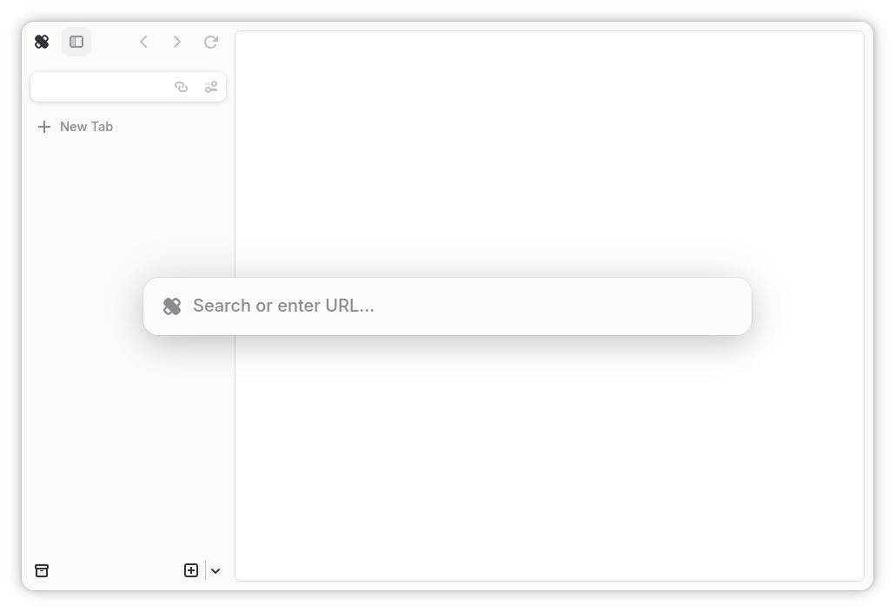
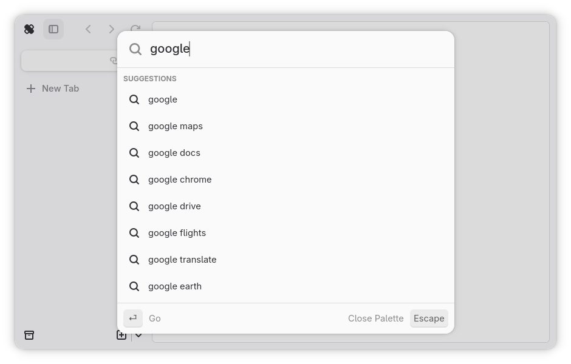
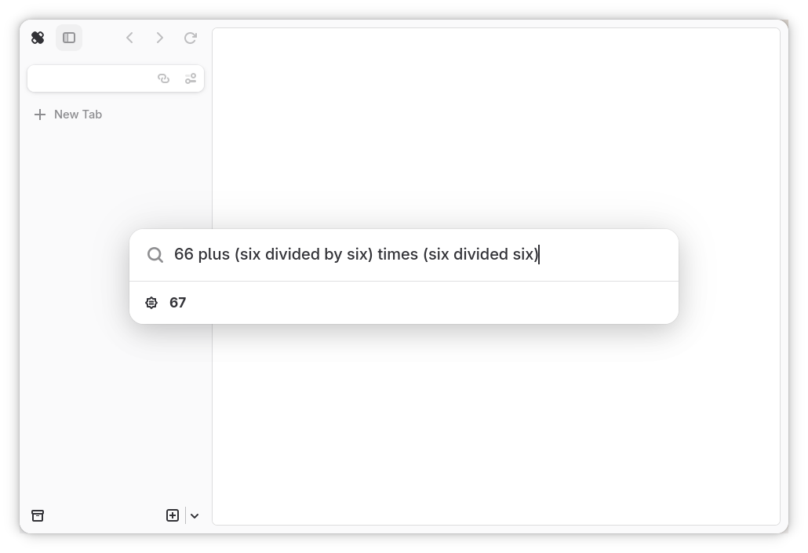

# Command Palette

The command palette is the main way of getting around Ouch Browser, and the
first element displayed on startup. Think of it as the search bar of a
conventional web browser, but contains more features. Command palette includes
support for !bangs and search autocompletion out of box, which can both be
disabled inside [preferences](preferences.md). The command palette can be
summoned using <kbd>Ctrl</kbd> + <kbd>T</kbd> for a new tab, <kbd>Ctrl</kbd> +
<kbd>L</kbd> or <kbd>Alt</kbd> + <kbd>D</kbd> to change the current tab's URL
(considered the *de-facto* main way to summon the palette).

## !bangs

!bangs help you search websites that are not conventional search engines.
Autocompletion is possible via [preferences](preferences.md#enable-bang-autocomplete),
but may use an significant amount of resources due to the large amount of
!bangs stored.

### Ranking System

A simple ranking system is utilized for !bangs, and does not include any sort
of algorithm. There are three stages of !bang selection:

1. The `!` character is inputted into the command palette. This will switch
   from looking for search and website queries into looking for relevant !bangs
   for the query.
2. A complete !bang would be inputted along with a space. The backend will
   search for the !bang, and preload the matching one to complement the palette
   UI.
3. The user hits <kbd>Enter</kbd> or presses the <kbd>&gt;</kbd> button on
   mobile. The !bang is loaded once again, and creates a new tab with the query
   to the !bang's search page

Right before the third stage invokes, the backend will increment the ranking of
the !bang by `1`. All !bangs by default are assumed to be ranked at `0`,
therefore the selected !bang will be the first result. As the !bangs function
is utilized over time, it becomes accurate, with the relevant !bang being *one
of the first* autocomplete results.

## Search

Search allows you to search the internet using the search engine selected in
[preferences](preferences.md#enable-search-autocomplete).
Due to technical limitations, the command palette only fetches autocomplete
results from DuckDuckGo. Autocompletion can be disabled in preferences.

### Wolfram|Alpha

Wolfram|Alpha can be used to complement search autocomplete by providing
smarter results, such as providing calculations, distances, and definitions.
You will need to provide your own Wolfram|Alpha App ID under the short answers
API, as Ouch Browser does not come with it's own ID. The answers may be
unintelligible, so you may need to expand the answer.
