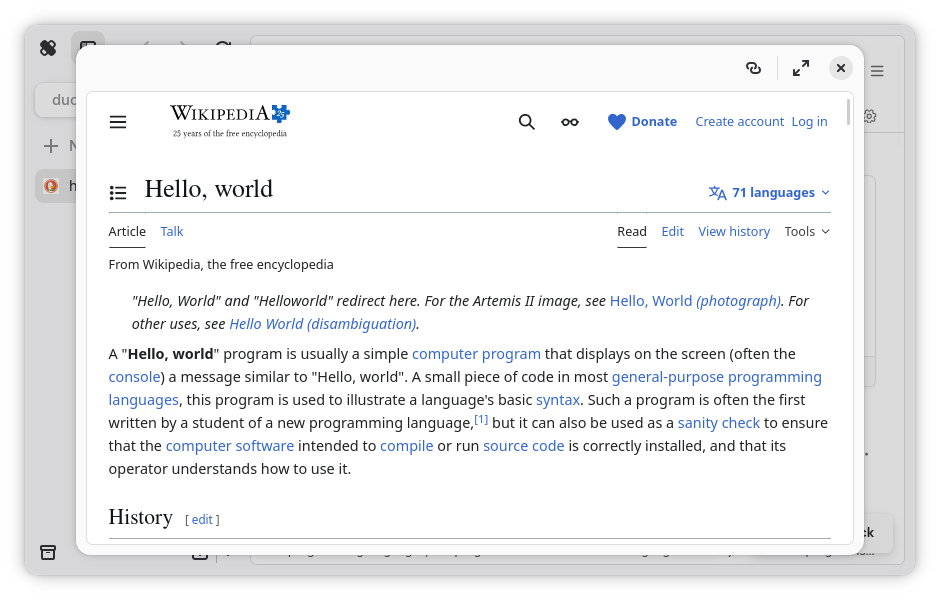

# Peek Tabs

An peek tab is a temporary tab that is used for quick browsing, which is what
peek tabs is mostly designed after. Due to being a "simple tab," you cannot
navigate backward or forward, refresh, or change the URL. If you would like to
do this, you will need to expand the tab into the main view. This will not
make you lose your scroll position or your progress.

It can be summoned holding down the [selected peek tab trigger](./preferences.md#peek-trigger),
and clicking on a hyperlink. An alternative way is to right-click on the
hyperlink, and select "Open in Peek Tab," which may be preferred for users
of touchscreens.
