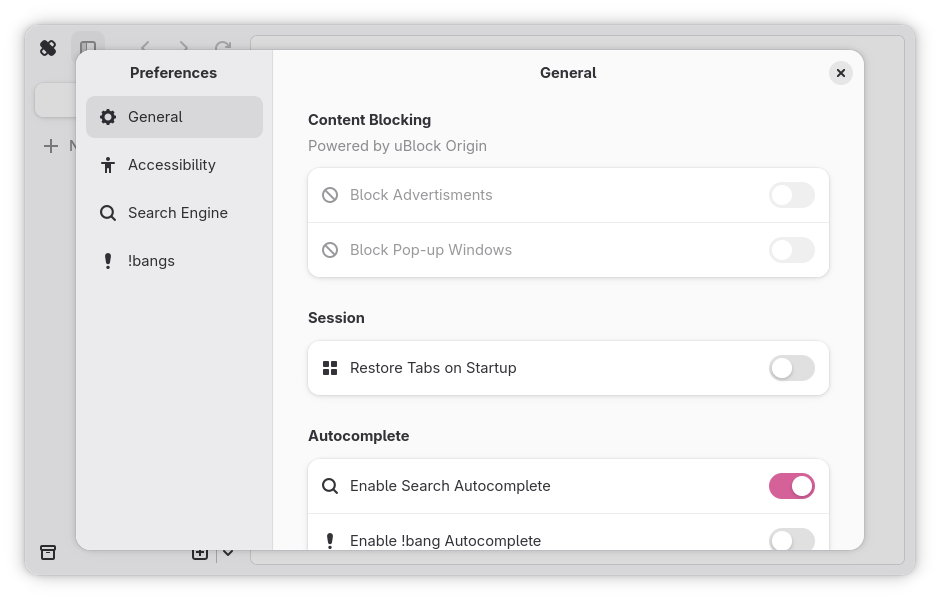

# Preferences

The preferences dialog can be used to customize Ouch Browser to your liking.
It can be summoned using <kbd>Ctrl</kbd> + <kbd>,</kbd>.

---

## General

General Ouch Browser preferences that are too loose to be categorized.

### Content Blocking

> [!IMPORTANT]
> None of these preferences are currently implemented. This only reflects the
> intentions of how these will be implemented.

> [!NOTE]
> As Ouch Browser does not support WebExtensions yet, uBlock Origin is not
> *actually* used, but instead uBlock Origin filters.

This configures how Ouch Browser blocks certain elements of a webpage, such as
ads. <!-- Content blocked by parental controls will always be blocked,
therefore cannot be modified in Ouch Browser. -->

#### Block Advertisments

> **gsettings Key**: *TBD*
> 
> **Type**: Boolean
> 
> **Default**: `true`

This setting determines whether advertisments will be blocked via an uBlock
Origin filter.

#### Block Pop-up Windows

> **gsettings Key**: *TBD*
> 
> **Type**: Boolean
> 
> **Default**: `true`

This setting determines whether pop-up windows will be blocked.

### Session

> [!IMPORTANT]
> None of these preferences are currently implemented. This only reflects the
> intentions of how these will be implemented.

This configures how Ouch Browser saves and/or restores the session state.

#### Restore Tabs on Startup

> **gsettings Key**: *TBD*
> 
> **Type**: Boolean
> 
> **Default**: `false`

> [!NOTE]
> While there is no gsettings key to restore tabs of the current session,
> there is the gsettings key `restore-tabs` that opens a specific set of URLs
> upon startup

This setting determines whether the tabs of the current session will be saved
for recreation upon next startup.

### Autocomplete

This configures how autocompletion works inside the [command palette](./command-palette.md).

#### Enable Search Autocomplete

> **gsettings Key**: `search-autocomplete-enabled`
> 
> **Type**: Boolean
> 
> **Default**: `true`

This setting determines whether searching inside the command palette shows
autocompletion results. This will send your search query to DuckDuckGo for
completion.

#### Enable !bang Autocomplete

> **gsettings Key**: `bang-autocomplete-enabled`
> 
> **Type**: Boolean
> 
> **Default**: `false`

This setting determines whether entering a !bang inside the command palette
shows autocompletion results. The autocompletion process happens locally,
therefore utilizes more resources. Individual !bangs gain higher ranking inside
autocompletion results over time with use. See the [command palette manual](./command-palette.md#ranking-system)
for more details.

### Peek Tabs

This configures how [peek tabs](./peek-tabs.md) work.

#### Peek Trigger

> **gsettings Key**: `peek-trigger`
> 
> **Type**: Enumeration
> 
> **Enumeration ID**: `page.codeberg.shrimple.OuchBrowser.PEEK_TRIGGER`
> 
> **Enumeration Nicknames**: `"shift"`, `"ctrl"`, `"alt"`
> 
> **Default**: `"shift"`

This setting determines what key will be used to trigger a new peek tab
combined with clicking on a hyperlink.

### Developer

This configures developer extras. These mostly pertain to WebKit and not
Ouch Browser in itself.

#### Enable Developer Tools

> **gsettings Key**: `devtools-enabled`
> 
> **Type**: Boolean
> 
> **Default**: `false`

This setting determines whether Web Inspector is enabled.

## Accessibility

Prefrences that pertain to ease of use in Ouch Browser. Accessibility is an
long-term effort of Ouch Browser, so more preferences will appear here over
time.

### Content

