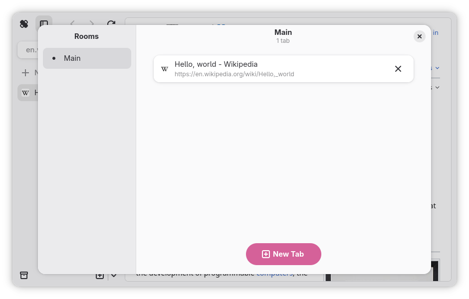

# Rooms Overview

The rooms overview is a dialog that displays all rooms and tabs inside them.
This is used as the main mode of tab navigation on mobile, but is also
encouraged for desktop use as well. It can be summoned using <kbd>Ctrl</kbd> +
<kbd>Shift</kbd> + <kbd>&bsol;</kbd>, or the "View All Tabs" button located
inside the main menu on desktop, or the tabs button on mobile.
